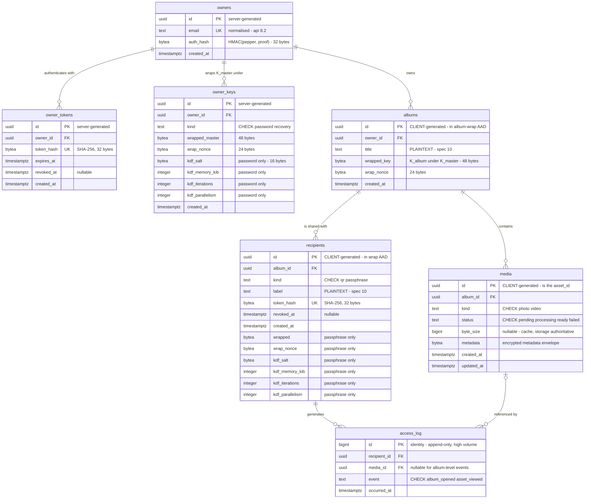

# Vitrina — Database Schema

**Status:** Draft v0.1 · last updated 14 September 2026 · **provisional**
**Companion to:** `vitrina-project-brief.md` §9–§9.3, `vitrina-encryption-spec.md` §6
**Implemented by:** `001_initial_schema.sql` (B.5) and `002` (Phase 1)

---

## 0. Status and authority

This document describes the shape the applied migrations implement — `001_initial_schema.sql` from B.5 and `002` from Phase 1. It is **provisional** — Phase 1 will change it, and that is expected rather than a failure.

If this document and the migration ever disagree, that is a bug in one of them. Fix it deliberately and note which. Do not let them drift.

"Applied" is a fact about a database, not about a repository, and packages/server/scripts/migrate.mjs is what makes it checkable. The runner applies every migration in packages/server/migrations/ in order, idempotently, inside one transaction each, and records what it did in schema_migrations — version, filename, SHA-256 and applied_at. A migrate one-shot in docker compose runs it on every up, gated on Postgres's healthcheck, so there is no incantation that brings up a database without migrating it.

The checksum is this section's never-edit-an-applied-migration rule as a failing command. An applied file whose hash no longer matches is a hard error with no "update the recorded hash" path, because there is no circumstance in which that is the right fix.

The runner cannot be told what was applied, by design. A database migrated by hand before the runner existed has no schema_migrations rows to match, and the only way forward is down -v. That is deliberate: a runner that accepts an assertion about history is a runner that records a claim, which is the thing this paragraph exists to stop. track-b-status once recorded B.5 as applied to vitrina — true of a volume that no longer existed, and the compose database was empty when 002 ran.

Reasoning lives in brief §9.1 (why two auth mechanisms), §9.2 (what is deliberately absent), and §9.3 (constraints DDL cannot express). This document does not repeat it.

## 1. Conventions

| Convention            | Rule                                                                                                                                                                                                                  |
| --------------------- | --------------------------------------------------------------------------------------------------------------------------------------------------------------------------------------------------------------------- |
| Identifiers           | UUIDv4 in `uuid` columns, everywhere                                                                                                                                                                                  |
| Timestamps            | `timestamptz` always, never `timestamp`                                                                                                                                                                               |
| ID generation         | Server-assigned (`gen_random_uuid()`) **except** `albums.id`, `media.id` and `recipients.id`, which are client-supplied with **no default**. All three are inside an AAD, which is the rule rather than a coincidence |
| Enumerations          | `text` plus a `CHECK`, not native Postgres `ENUM` — a provisional schema needs values that are cheap to change                                                                                                        |
| Token hashes          | **SHA-256 over the 32 raw token bytes**, never over any textual encoding of them. Stored `bytea` (32 bytes). See §6                                                                                                   |
| Password / passphrase | Argon2id, never SHA-256                                                                                                                                                                                               |
| Deletion              | `ON DELETE CASCADE` on every foreign key — see §5, and the constraint it does _not_ satisfy                                                                                                                           |

**The two client-generated IDs are not a style choice.** `media.id` _is_ the envelope's `asset_id`, fixed before encryption begins. `recipients.id` sits inside the wrap AAD (`"vitrina-wrap-v1" ‖ recipient_id`, encryption spec §6.2), so the client must know it before it can compute `wrapped`. A `DEFAULT gen_random_uuid()` on either column produces blobs that cannot be unwrapped, works fine for QR recipients, and fails as an opaque AEAD error.

## 2. Diagram

_Illustrative only. The §3 tables are normative — Mermaid cannot express nullability, defaults or `CHECK` constraints, so nothing about those should be inferred from here. **The caveat covers what Mermaid cannot say, not what this diagram forgot**: entities, relationships and id provenance must match §3, and did not between 13 and 14 September 2026._



## 3. Tables

### `owners`

| Column       | Type          | Constraints                     |
| ------------ | ------------- | ------------------------------- |
| `id`         | `uuid`        | PK, default `gen_random_uuid()` |
| `created_at` | `timestamptz` | NOT NULL, default `now()`       |

The account model is email and password (brief §12). These columns landed in `002`:

| Column      | Type    | Constraints                                                                              |
| ----------- | ------- | ---------------------------------------------------------------------------------------- |
| `email`     | `text`  | NOT NULL, UNIQUE (`UQ_owners_email`). Holds the **normalised** address — api-sketch §8.2 |
| `auth_hash` | `bytea` | NOT NULL, 32 bytes — `HMAC(pepper, proof)`. Encryption spec §6.6                         |

**`text` rather than `citext`, and no `lower()` constraint.** Either would be a _second_ normaliser: `citext` folds by its own rules and `lower()` is collation-dependent, so either can disagree with the unconditional mapping api-sketch §8.2 specifies — in cases nobody finds until an owner cannot log in. §8.2's whole argument is that the rule is simple _because_ it has one implementation; a fold in the database is the same mistake as one in the client, only closer.

**No `auth_salt` and no server-side KDF columns.** The relay applies a peppered fast hash, not Argon2id, so there is nothing per-account to parameterise. An earlier revision of this document added those columns; withdrawn.

**One KDF parameter set exists**, on `owner_keys`, client-side, sized for the weakest phone. It is what `/login/params` returns.

Case-folding `email` matters — two rows differing only in case would be two accounts one user cannot tell apart — and it happens in exactly one place, before any lookup, uniqueness check or decoy computation (api-sketch §8.2).

### `owner_tokens`

| Column       | Type          | Constraints                     |
| ------------ | ------------- | ------------------------------- |
| `id`         | `uuid`        | PK, default `gen_random_uuid()` |
| `owner_id`   | `uuid`        | NOT NULL, FK → `owners(id)`     |
| `token_hash` | `bytea`       | NOT NULL, UNIQUE                |
| `expires_at` | `timestamptz` | NOT NULL                        |
| `revoked_at` | `timestamptz` | NULL                            |
| `created_at` | `timestamptz` | NOT NULL, default `now()`       |

Hashed rows with expiry, **not** server-side sessions — non-negotiable #6. Several rows per owner is normal, one per signed-in device. `token_hash` is SHA-256 of a 32-byte random token; there is nothing to brute-force in 256 bits of entropy, and Argon2id here would be pure per-request cost.

### `owner_keys`

_Added by `002`._

| Column            | Type          | Constraints                                                     |
| ----------------- | ------------- | --------------------------------------------------------------- |
| `id`              | `uuid`        | PK, default `gen_random_uuid()`                                 |
| `owner_id`        | `uuid`        | NOT NULL, FK → `owners(id)` `ON DELETE CASCADE`                 |
| `kind`            | `text`        | NOT NULL, `CHECK (kind IN ('password','recovery'))`             |
| `wrapped_master`  | `bytea`       | NOT NULL, 48 bytes — `K_master` (32) plus the Poly1305 tag (16) |
| `wrap_nonce`      | `bytea`       | NOT NULL, 24 bytes                                              |
| `kdf_salt`        | `bytea`       | NULL — required for `kind = 'password'`                         |
| `kdf_memory_kib`  | `integer`     | NULL — required for `kind = 'password'`                         |
| `kdf_iterations`  | `integer`     | NULL — required for `kind = 'password'`                         |
| `kdf_parallelism` | `integer`     | NULL — required for `kind = 'password'`                         |
| `created_at`      | `timestamptz` | NOT NULL, default `now()`                                       |

**Several rows per owner is the point.** Each holds the same `K_master` wrapped under a different credential — the password today, a recovery key in Phase 2, potentially a per-device key later. Brief §11: a single `master_key_wrapped` column on `owners` would choose no-recovery permanently, whereas this makes Phase 2 an `INSERT` with no migration and no re-encryption.

A password change re-wraps `K_master` and updates the `password` row. **Album keys are never touched**, because `K_album` is wrapped by `K_master` rather than derived from it (encryption spec §2).

**KDF parameters are per row, and that is load-bearing.** The same argument as encryption spec §6.2's per-recipient parameters — hardcoding them turns "the owner-password parameters remain open" (brief §12) into "frozen at first implementation", and unlike the recipient case an owner's entire album collection hangs off that wrapping. Per row, raising them is real: the next login re-derives under the new figures and re-wraps `K_master`, which is exactly what the N-rows design buys.

They are nullable because a **recovery key is high-entropy random and needs no password KDF at all** — the same shape as `recipients`, where the passphrase columns are NULL for QR recipients. Enforce it:

```sql
CHECK (
  kind <> 'password' OR (
        kdf_salt IS NOT NULL AND octet_length(kdf_salt) = 16
    AND kdf_memory_kib  IS NOT NULL AND kdf_memory_kib  >= 16384
    AND kdf_iterations  IS NOT NULL AND kdf_iterations  >= 2
    AND kdf_parallelism IS NOT NULL AND kdf_parallelism >= 1
  )
)
```

**The floors are floors, not the chosen values.** 16384/2/1, matching `recipients` as corrected by `002`. A client may post _higher_ parameters — that is the entire reason they are stored per row — so a constraint pinned to v1's 65536/3/1 would reject every account created after Phase 2 raises the default. See `recipients` below for the same argument and the same correction.

`CHECK (octet_length(wrapped_master) = 48 AND octet_length(wrap_nonce) = 24)`, for the same reason as `recipients`.

**Exactly one password row per owner, enforced rather than assumed:**

```sql
CREATE UNIQUE INDEX "UQ_owner_keys_one_password"
  ON "owner_keys" ("owner_id") WHERE kind = 'password';
```

Two routes select by that predicate — `/login/params` and `/owner/key` (api-sketch §7.5, §8.3) — and a `SELECT … LIMIT 1` without it works until a second row exists. The rule was prose in two documents with no mechanism until `002`; a partial unique index is the mechanism.

**v1 has exactly one row per owner** in practice as well as by constraint, `kind = 'password'`. Recovery is Phase 2, and arrives as an `INSERT` the index above permits.

### `albums`

| Column        | Type          | Constraints                                                                                                                                                                 |
| ------------- | ------------- | --------------------------------------------------------------------------------------------------------------------------------------------------------------------------- |
| `id`          | `uuid`        | PK, **no default** — client-supplied. It is inside the album-wrap AAD (encryption spec §2), so the client must hold it before wrapping. `002` dropped the default `001` had |
| `owner_id`    | `uuid`        | NOT NULL, FK → `owners(id)`                                                                                                                                                 |
| `title`       | `text`        | NOT NULL                                                                                                                                                                    |
| `wrapped_key` | `bytea`       | NOT NULL, 48 bytes — `K_album` under `K_master`, added by `002`. Brief §11's wrap-never-derive requires it and `001` had no column for it                                   |
| `wrap_nonce`  | `bytea`       | NOT NULL, 24 bytes                                                                                                                                                          |
| `created_at`  | `timestamptz` | NOT NULL, default `now()`                                                                                                                                                   |

No `status` column — brief §9.2. `title` is plaintext on the relay; that is a recorded limitation (encryption spec §10). **It is no longer coupled to the owner-key question** — brief §11 closed that, and closed it in the direction that dissolves the coupling, since an owner who unwraps `K_master` at login can decrypt their own titles. This note said otherwise until 13 September 2026 and contradicted §5.

`CHECK (octet_length(wrapped_key) = 48 AND octet_length(wrap_nonce) = 24)`, for the same reason as `recipients` and `owner_keys`.

### `media`

| Column       | Type          | Constraints                                                                                                                                                                    |
| ------------ | ------------- | ------------------------------------------------------------------------------------------------------------------------------------------------------------------------------ |
| `id`         | `uuid`        | PK, **no default** — client-supplied                                                                                                                                           |
| `album_id`   | `uuid`        | NOT NULL, FK → `albums(id)`                                                                                                                                                    |
| `kind`       | `text`        | NOT NULL, `CHECK (kind IN ('photo','video'))`                                                                                                                                  |
| `status`     | `text`        | NOT NULL, default `'pending'`, `CHECK (status IN ('pending','processing','ready','failed'))`                                                                                   |
| `byte_size`  | `bigint`      | NULL                                                                                                                                                                           |
| `metadata`   | `bytea`       | NOT NULL, as of `002`. The API posts the envelope at media create (api-sketch §9.6), so no row ever exists without one; `001`'s nullability admitted a state no route produces |
| `created_at` | `timestamptz` | NOT NULL, default `now()`                                                                                                                                                      |
| `updated_at` | `timestamptz` | NOT NULL, default `now()`                                                                                                                                                      |

`id` is the envelope's `asset_id`. Asset and thumbnail object keys derive from it; there is no object-key column (brief §9.2).

`kind` carries `'video'` from day one although Phase 3 is far away — non-negotiable #8. `status` will resolve in about 200 ms for photos and feels like pointless machinery; it exists so video does not require touching every UI surface that assumed uploaded meant viewable.

`byte_size` is nullable because the row is created before the object exists, and is a denormalised cache — object storage is authoritative. `metadata` holds the encrypted metadata envelope as bytes, per encryption spec §7. `updated_at` exists so a row stuck in `processing` is detectable.

### `recipients`

| Column            | Type          | Constraints                                     |
| ----------------- | ------------- | ----------------------------------------------- |
| `id`              | `uuid`        | PK, **no default** — client-supplied            |
| `album_id`        | `uuid`        | NOT NULL, FK → `albums(id)`                     |
| `kind`            | `text`        | NOT NULL, `CHECK (kind IN ('qr','passphrase'))` |
| `label`           | `text`        | NOT NULL                                        |
| `token_hash`      | `bytea`       | NOT NULL, UNIQUE                                |
| `revoked_at`      | `timestamptz` | NULL                                            |
| `created_at`      | `timestamptz` | NOT NULL, default `now()`                       |
| `wrapped`         | `bytea`       | NULL                                            |
| `wrap_nonce`      | `bytea`       | NULL                                            |
| `kdf_salt`        | `bytea`       | NULL                                            |
| `kdf_memory_kib`  | `integer`     | NULL                                            |
| `kdf_iterations`  | `integer`     | NULL                                            |
| `kdf_parallelism` | `integer`     | NULL                                            |

The last six columns are the four conceptual items of encryption spec §6.2 — `wrapped`, `wrap_nonce`, `salt`, and the Argon2id parameters, which are three integers. All six are NULL for QR recipients and all six NOT NULL for passphrase recipients, enforced by one constraint:

```sql
CHECK (
  (kind = 'qr'         AND wrapped IS NULL     AND wrap_nonce IS NULL
                       AND kdf_salt IS NULL    AND kdf_memory_kib IS NULL
                       AND kdf_iterations IS NULL AND kdf_parallelism IS NULL)
  OR
  (kind = 'passphrase' AND wrapped IS NOT NULL AND wrap_nonce IS NOT NULL
                       AND kdf_salt IS NOT NULL AND kdf_memory_kib IS NOT NULL
                       AND kdf_iterations IS NOT NULL AND kdf_parallelism IS NOT NULL)
)
```

A second constraint pins the lengths the spec fixes exactly, and floors the KDF parameters so they can be raised but never weakened:

```sql
CHECK (
  kind = 'qr' OR (
        octet_length(kdf_salt)   = 16      -- crypto_pwhash_SALTBYTES
    AND octet_length(wrap_nonce) = 24      -- XChaCha20-Poly1305 nonce
    AND octet_length(wrapped)    = 48      -- K_album (32) + Poly1305 tag (16)
    AND kdf_memory_kib  >= 16384           -- absolute floor, NOT the v1 value
    AND kdf_iterations  >= 2
    AND kdf_parallelism >= 1
  )
)
```

For QR recipients every column is NULL, the right-hand side evaluates to NULL, and `kind = 'qr'` satisfies the OR. A wrong length in any of the three `bytea` columns is not a style problem — it is a blob that cannot be unwrapped, discovered at unwrap time rather than at insert time.

The `48` is coupled to version 1 of the wrap format. If §6.2 ever changes, this constraint must change with it — which is a feature: it forces the format change to be deliberate rather than silent.

**The KDF floors are deliberately well below v1's chosen parameters** (64 MiB, t=3, p=1 — encryption spec §6.2). They are an absolute minimum, not a restatement of the current value, and the distinction is what makes them useful: a client may post _higher_ parameters, which is the entire reason they are stored per row, so a floor pinned to 65536 rejects every **invite** created after Phase 2 raises the default. (On `owner_keys` the same argument is about accounts; here it is invites, and the tables differ in what a row is.)

**`001` shipped the chosen values where floors belong** — `>= 65536` and `>= 3` — and `002` corrected them to 16384/2/1. That looks like weakening a constraint and is not: it is the difference between a minimum and a current setting, and getting it backwards is the specific bug `001` had.

_A second argument stood here until 14 September 2026: that V.1 might lower 64 MiB and a floor at 65536 would block the corrected value. V.1 passed at 2239 ms against a 3000 ms ceiling (phase-0-plan §8), so the figures are confirmed rather than provisional and that half no longer applies. The floors are unchanged, on the Phase 2 argument alone._

What the floor does protect against is degradation to something pointless — a bug or a careless migration setting memory to a few hundred KiB, which would make the offline attack §6.3 exists to manage effectively free.

If V.1 ever forces the chosen value _below_ this floor, do not relax the floor. That result would mean Argon2id cannot be run at meaningful strength on target hardware, which is a question about whether passphrase mode is viable at all — not a constraint to loosen quietly.

Parameters are stored per row rather than hardcoded so they can be raised later without invalidating existing invitations (encryption spec §6.2). **`wrap_nonce` is the column that gets forgotten**, and without it the wrapped blob is undecryptable.

Recipients have no account and no separate token table. There is no `access_tokens` table — brief §9.1. Revocation is setting `revoked_at`; it stops future ciphertext being served and does nothing about anything already retrieved (encryption spec §6.4).

### `access_log`

| Column         | Type          | Constraints                                                  |
| -------------- | ------------- | ------------------------------------------------------------ |
| `id`           | `bigint`      | PK, `GENERATED ALWAYS AS IDENTITY`                           |
| `recipient_id` | `uuid`        | NOT NULL, FK → `recipients(id)`                              |
| `media_id`     | `uuid`        | NULL, FK → `media(id)`                                       |
| `event`        | `text`        | NOT NULL, `CHECK (event IN ('album_opened','asset_viewed'))` |
| `occurred_at`  | `timestamptz` | NOT NULL, default `now()`                                    |

**Granularity is per asset opened, never per chunk fetched.** A hundred-photo album is roughly twelve hundred chunk requests; logging those answers no question anyone asked and makes the table unusable. `media_id` is NULL for `album_opened`.

`bigint` identity rather than `uuid` because this is append-only and the highest-volume table by a wide margin. The `CHECK` starts with two values deliberately; adding one later is a cheap constraint change, whereas free text drifts into three spellings of "viewed" within a month.

Retention is a Phase 2 GDPR item — viewing behaviour is personal data.

## 4. Indexes

Beyond primary keys and the unique constraints, eight indexes exist — six from `001`, two from `002`:

```sql
CREATE INDEX "IDX_album_owner_id"          ON "albums"       ("owner_id");
CREATE INDEX "IDX_owner_token_owner_id"    ON "owner_tokens" ("owner_id");
CREATE INDEX "IDX_media_album_id"          ON "media"        ("album_id");
CREATE INDEX "IDX_recipient_album_id"      ON "recipients"   ("album_id");
CREATE INDEX "IDX_access_log_recipient_id" ON "access_log"   ("recipient_id", occurred_at DESC);
CREATE INDEX "IDX_access_log_media_id"     ON "access_log"   ("media_id");

-- 002
CREATE INDEX        "IDX_owner_key_owner_id"     ON "owner_keys" ("owner_id");
CREATE UNIQUE INDEX "UQ_owner_keys_one_password" ON "owner_keys" ("owner_id") WHERE kind = 'password';
```

**The partial unique index is also the access path.** Both routes that read a wrapping — `/login/params` and `/owner/key` — filter `kind = 'password'`, which is exactly its predicate, so it serves the reads as well as enforcing the constraint. The plain `owner_keys(owner_id)` index is `001`'s index-every-FK convention carried forward, and what it serves is the cascade when an owner is deleted.

`albums(owner_id)` serves the most frequent query in the owner flow — listing an owner's albums. The two `access_log` indexes serve the two questions the log exists to answer: what has this recipient seen, and who has seen this photograph. The composite one carries `occurred_at DESC` so the common "most recent activity" read is satisfied by the index alone.

## 5. Open, and not to be resolved by whatever the migration happens to say

**`ON DELETE` behaviour is decided: `CASCADE` on every foreign key** (11 August 2026).

| Foreign key (where the constraint lives)     | On delete | What that means in practice                   |
| -------------------------------------------- | --------- | --------------------------------------------- |
| `owner_tokens.owner_id` → `owners(id)`       | `CASCADE` | Delete an **owner** → their auth tokens go    |
| `owner_keys.owner_id` → `owners(id)`         | `CASCADE` | Delete an **owner** → their key wrappings go  |
| `albums.owner_id` → `owners(id)`             | `CASCADE` | Delete an **owner** → their albums go         |
| `media.album_id` → `albums(id)`              | `CASCADE` | Delete an **album** → its media rows go       |
| `recipients.album_id` → `albums(id)`         | `CASCADE` | Delete an **album** → its recipients go       |
| `access_log.recipient_id` → `recipients(id)` | `CASCADE` | Delete a **recipient** → their log entries go |
| `access_log.media_id` → `media(id)`          | `CASCADE` | Delete a **media row** → its log entries go   |

Note that the arrows point _up_ the tree — a foreign key is named for where it lives and what it references — while the cascade propagates _down_ it. Deleting one owner therefore removes that owner's tokens, albums, every media row and recipient in those albums, and every log entry belonging to those recipients, in one statement.

An earlier draft of this document claimed that cascading into `access_log` would destroy an audit trail evidencing erasure. **That reasoning was wrong and has been withdrawn.** `access_log` records views, not deletions, so it was never evidence that an erasure happened — and it is itself personal data about recipients' viewing behaviour, which makes it subject to erasure rather than something to preserve against it.

Cascade is also structurally forced. `albums → recipients` cascades, so if `recipients → access_log` did not, log rows would block every recipient delete and albums would become undeletable. Note that revoking a recipient sets `revoked_at` and deletes nothing; a `recipients` row is only ever deleted when its album or owner goes, which is exactly when that history should go too.

`media → access_log` is moot in v1, since Phase 1 has no album editing and individual assets are never deleted. Cascade for consistency; revisit when editing arrives.

### 5.1 What cascade does not do, and why it is dangerous on its own

**A database cascade deletes rows. It does not delete objects from the bucket.**

Delete an owner and Postgres will tidily remove their albums, media rows, recipients, and log entries — while every encrypted photograph remains in object storage indefinitely. Two consequences, and the second is serious:

- You keep paying to store data you believe is gone.
- **You have failed to erase the actual image data while reporting success.** That is a GDPR erasure failure with a false confirmation attached.

Cascade makes it worse rather than better, because the rows it removes are the only record of which objects existed. `media.id` _is_ the object key (§3), so once the row is gone the ciphertext is unreachable, unidentifiable, and undiscoverable except by enumerating the entire bucket.

**Therefore: deleting an album or an owner MUST be an application operation, never a raw `DELETE`.** Enumerate the media, delete the storage objects, verify, then delete the rows — or soft-delete and reconcile with a worker. `ON DELETE CASCADE` is a referential-integrity safety net for rows, not the mechanism of erasure.

This is a **B.6 requirement**: the API sketch must state that no endpoint deletes an album or owner row without first having deleted the corresponding storage objects.

**~~`owners` shape~~ — closed and shipped.** Brief §12 decided email and password; the columns and the `owner_keys` table landed in `002` and are described in §3.

**Whether `albums.title` and `recipients.label` stay plaintext** — still open, but **no longer blocked**. It was parked because it was coupled to owner key retention; brief §11 closed that, and an owner who unwraps `K_master` at login can decrypt their own titles (encryption spec §10). Note deferring is not free: the relay cannot re-encrypt what it cannot read, so shipping plaintext means a client-side lazy migration later.

## 6. Token hashing — the canonical form

Two implementations compute this hash independently and must agree byte for byte: the client hashes at recipient-create time (so the plaintext token never reaches the relay), and the server hashes the presented bearer token on every request. A disagreement makes every invite in the system fail identically, with no diagnostic.

**The rule:**

1. The canonical input is the **32 raw token bytes**. Never the base64url string, never hex, never any other encoding.
2. `Authorization: Bearer` carries the **base64url form** — it is what sits in the invite fragment, and headers are text. The server therefore decodes, then hashes.
3. **Decoding is strict, and the encoding must be canonical.** Exactly 43 characters, the base64url alphabet (`-` and `_`, not `+` and `/`), no padding, decoding to exactly 32 bytes — and then **re-encode and require the result to equal the input.** Anything else is rejected at the boundary rather than hashed.

   The re-encoding check is not pedantry. 43 base64url characters carry 258 bits and a token is 256, so the two spare bits in the final character mean **four distinct 43-character strings decode to the same 32 bytes.** "43 characters decoding to 32 bytes" therefore does not identify a unique string. Any standard encoder given 32 bytes emits the canonical spelling with those bits zero, so no legitimate token ever fails this check.

4. **The base64url form is transport only.** Because the hash is taken over decoded bytes, all four spellings would authenticate identically even without rule 3 — which is why rule 3 is a guard rather than a security control. Never compare token strings: not as a cache key, not for log deduplication, not for rate limiting. #10 keys the limiter on the hash for exactly this reason.
5. The server cannot validate that a stored hash corresponds to a well-formed token, and must not try — any 32 random bytes is a valid token, so there is nothing to check.

**This requires a conformance vector**, not just this prose: one known token, in both its raw-byte and base64url forms, with its expected SHA-256. Both implementations run it.

_Note as of Phase 0: the canonicality rule above has two test-only implementations — one in the crate's vector generator, one in the TypeScript harness. When Phase 1 writes the production one, those two must import it or be deleted. Three copies of a rule is §9.1's failure class reproduced inside the machinery built to prevent it._ See encryption spec §9 — the same mechanism, applied outside the envelope.

`owner_tokens.token_hash` follows the same rule. Only the server hashes it today, so the cross-implementation risk is lower, but one rule for both is cheaper than two.
