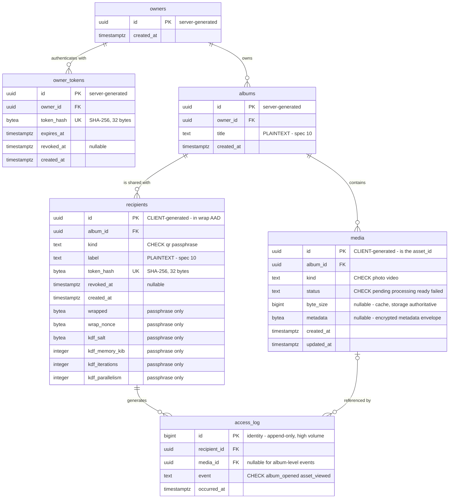

# Vitrina — Database Schema

**Status:** Draft v0.1 · 11 August 2026 · **provisional**
**Companion to:** `vitrina-project-brief.md` §9–§9.3, `vitrina-encryption-spec.md` §6
**Implemented by:** the B.5 migration

---

## 0. Status and authority

This document specifies the shape the B.5 migration implements. It is **provisional** — Phase 1 will change it, and that is expected rather than a failure.

If this document and the migration ever disagree, that is a bug in one of them. Fix it deliberately and note which. Do not let them drift.

Reasoning lives in brief §9.1 (why two auth mechanisms), §9.2 (what is deliberately absent), and §9.3 (constraints DDL cannot express). This document does not repeat it.

## 1. Conventions

| Convention | Rule |
| --- | --- |
| Identifiers | UUIDv4 in `uuid` columns, everywhere |
| Timestamps | `timestamptz` always, never `timestamp` |
| ID generation | Server-assigned (`gen_random_uuid()`) **except** `media.id` and `recipients.id`, which are client-supplied with **no default** |
| Enumerations | `text` plus a `CHECK`, not native Postgres `ENUM` — a provisional schema needs values that are cheap to change |
| Token hashes | SHA-256 of a 32-byte random token, stored `bytea` (32 bytes) |
| Password / passphrase | Argon2id, never SHA-256 |
| Deletion | `ON DELETE` behaviour is **not yet decided** — see §5 |

**The two client-generated IDs are not a style choice.** `media.id` *is* the envelope's `asset_id`, fixed before encryption begins. `recipients.id` sits inside the wrap AAD (`"vitrina-wrap-v1" ‖ recipient_id`, encryption spec §6.2), so the client must know it before it can compute `wrapped`. A `DEFAULT gen_random_uuid()` on either column produces blobs that cannot be unwrapped, works fine for QR recipients, and fails as an opaque AEAD error.

## 2. Diagram



## 3. Tables

### `owners`

| Column | Type | Constraints |
| --- | --- | --- |
| `id` | `uuid` | PK, default `gen_random_uuid()` |
| `created_at` | `timestamptz` | NOT NULL, default `now()` |

**Deliberately incomplete.** There is nothing here to authenticate against, because brief §12 still lists the account model as undecided — email required, or invite-only. Phase 1 cannot build the owner flow without adding to this table, and that is the right place to resolve it. A migration is not where an open product decision gets settled.

### `owner_tokens`

| Column | Type | Constraints |
| --- | --- | --- |
| `id` | `uuid` | PK, default `gen_random_uuid()` |
| `owner_id` | `uuid` | NOT NULL, FK → `owners(id)` |
| `token_hash` | `bytea` | NOT NULL, UNIQUE |
| `expires_at` | `timestamptz` | NOT NULL |
| `revoked_at` | `timestamptz` | NULL |
| `created_at` | `timestamptz` | NOT NULL, default `now()` |

Hashed rows with expiry, **not** server-side sessions — non-negotiable #6. Several rows per owner is normal, one per signed-in device. `token_hash` is SHA-256 of a 32-byte random token; there is nothing to brute-force in 256 bits of entropy, and Argon2id here would be pure per-request cost.

### `albums`

| Column | Type | Constraints |
| --- | --- | --- |
| `id` | `uuid` | PK, default `gen_random_uuid()` |
| `owner_id` | `uuid` | NOT NULL, FK → `owners(id)` |
| `title` | `text` | NOT NULL |
| `created_at` | `timestamptz` | NOT NULL, default `now()` |

No `status` column — brief §9.2. `title` is plaintext on the relay; that is a recorded limitation (encryption spec §10), coupled to the unresolved owner-key question in brief §11, and it must not be read as settled design.

### `media`

| Column | Type | Constraints |
| --- | --- | --- |
| `id` | `uuid` | PK, **no default** — client-supplied |
| `album_id` | `uuid` | NOT NULL, FK → `albums(id)` |
| `kind` | `text` | NOT NULL, `CHECK (kind IN ('photo','video'))` |
| `status` | `text` | NOT NULL, default `'pending'`, `CHECK (status IN ('pending','processing','ready','failed'))` |
| `byte_size` | `bigint` | NULL |
| `metadata` | `bytea` | NULL |
| `created_at` | `timestamptz` | NOT NULL, default `now()` |
| `updated_at` | `timestamptz` | NOT NULL, default `now()` |

`id` is the envelope's `asset_id`. Asset and thumbnail object keys derive from it; there is no object-key column (brief §9.2).

`kind` carries `'video'` from day one although Phase 3 is far away — non-negotiable #8. `status` will resolve in about 200 ms for photos and feels like pointless machinery; it exists so video does not require touching every UI surface that assumed uploaded meant viewable.

`byte_size` is nullable because the row is created before the object exists, and is a denormalised cache — object storage is authoritative. `metadata` holds the encrypted metadata envelope as bytes, per encryption spec §7. `updated_at` exists so a row stuck in `processing` is detectable.

### `recipients`

| Column | Type | Constraints |
| --- | --- | --- |
| `id` | `uuid` | PK, **no default** — client-supplied |
| `album_id` | `uuid` | NOT NULL, FK → `albums(id)` |
| `kind` | `text` | NOT NULL, `CHECK (kind IN ('qr','passphrase'))` |
| `label` | `text` | NOT NULL |
| `token_hash` | `bytea` | NOT NULL, UNIQUE |
| `revoked_at` | `timestamptz` | NULL |
| `created_at` | `timestamptz` | NOT NULL, default `now()` |
| `wrapped` | `bytea` | NULL |
| `wrap_nonce` | `bytea` | NULL |
| `kdf_salt` | `bytea` | NULL |
| `kdf_memory_kib` | `integer` | NULL |
| `kdf_iterations` | `integer` | NULL |
| `kdf_parallelism` | `integer` | NULL |

The last six columns are the four conceptual items of encryption spec §6.2 — `wrapped`, `wrap_nonce`, `salt`, and the Argon2id parameters, which are three integers. All six are NULL for QR recipients and all six NOT NULL for passphrase recipients, enforced by one constraint:

```sql
CHECK (
  (kind = 'qr'         AND wrapped IS NULL     AND wrap_nonce IS NULL
                       AND kdf_salt IS NULL    AND kdf_memory_kib IS NULL
                       AND kdf_iterations IS NULL AND kdf_parallelism IS NULL)
  OR
  (kind = 'passphrase' AND wrapped IS NOT NULL AND wrap_nonce IS NOT NULL
                       AND kdf_salt IS NOT NULL AND kdf_memory_kib IS NOT NULL
                       AND kdf_iterations IS NOT NULL AND kdf_parallelism IS NOT NULL)
)
```

Parameters are stored per row rather than hardcoded so they can be raised later without invalidating existing invitations (encryption spec §6.2). **`wrap_nonce` is the column that gets forgotten**, and without it the wrapped blob is undecryptable.

Recipients have no account and no separate token table. There is no `access_tokens` table — brief §9.1. Revocation is setting `revoked_at`; it stops future ciphertext being served and does nothing about anything already retrieved (encryption spec §6.4).

### `access_log`

| Column | Type | Constraints |
| --- | --- | --- |
| `id` | `bigint` | PK, `GENERATED ALWAYS AS IDENTITY` |
| `recipient_id` | `uuid` | NOT NULL, FK → `recipients(id)` |
| `media_id` | `uuid` | NULL, FK → `media(id)` |
| `event` | `text` | NOT NULL, `CHECK (event IN ('album_opened','asset_viewed'))` |
| `occurred_at` | `timestamptz` | NOT NULL, default `now()` |

**Granularity is per asset opened, never per chunk fetched.** A hundred-photo album is roughly twelve hundred chunk requests; logging those answers no question anyone asked and makes the table unusable. `media_id` is NULL for `album_opened`.

`bigint` identity rather than `uuid` because this is append-only and the highest-volume table by a wide margin. The `CHECK` starts with two values deliberately; adding one later is a cheap constraint change, whereas free text drifts into three spellings of "viewed" within a month.

Retention is a Phase 2 GDPR item — viewing behaviour is personal data.

## 4. Indexes

Beyond primary keys and the two unique constraints:

```sql
CREATE INDEX ON media (album_id);
CREATE INDEX ON recipients (album_id);
CREATE INDEX ON owner_tokens (owner_id);
CREATE INDEX ON access_log (recipient_id, occurred_at DESC);
CREATE INDEX ON access_log (media_id);
```

The last two serve the two questions the log exists to answer: what has this recipient seen, and who has seen this photograph.

## 5. Open, and not to be resolved by whatever the migration happens to say

**`ON DELETE` behaviour.** Cascade serves the right-to-erasure requirement in brief §11; cascading into `access_log` destroys the audit trail that would evidence the erasure having happened. Decide in B.6.

**`owners` shape**, pending brief §12's account model.

**Whether `albums.title` and `recipients.label` stay plaintext**, pending brief §11's owner-key question. The two are coupled and must be decided together (encryption spec §10).
